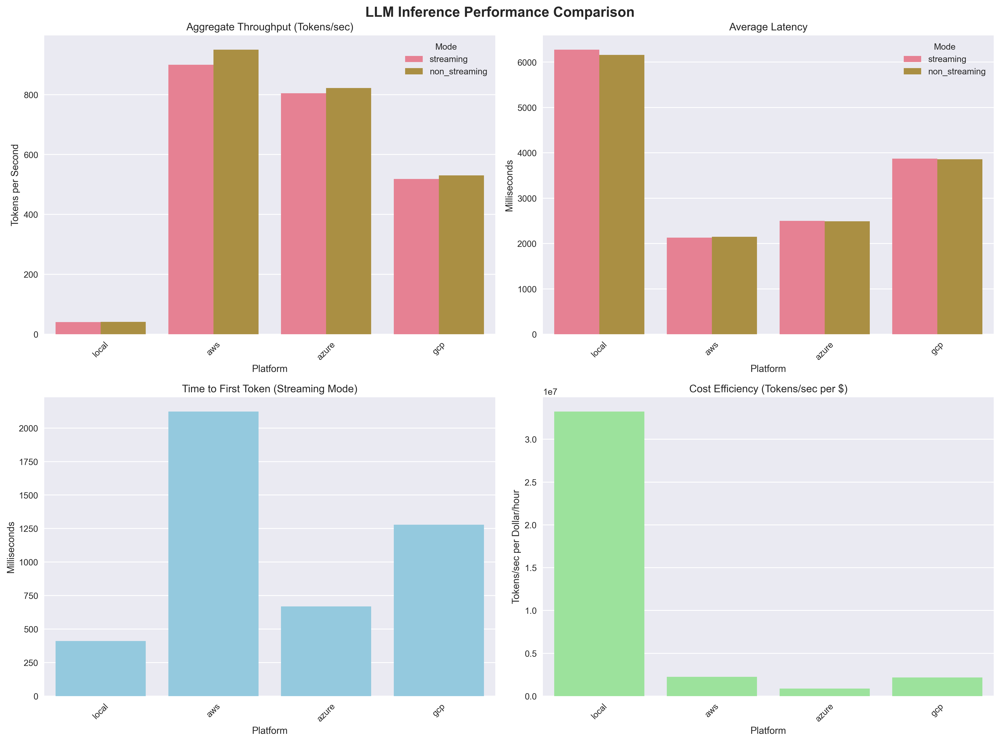
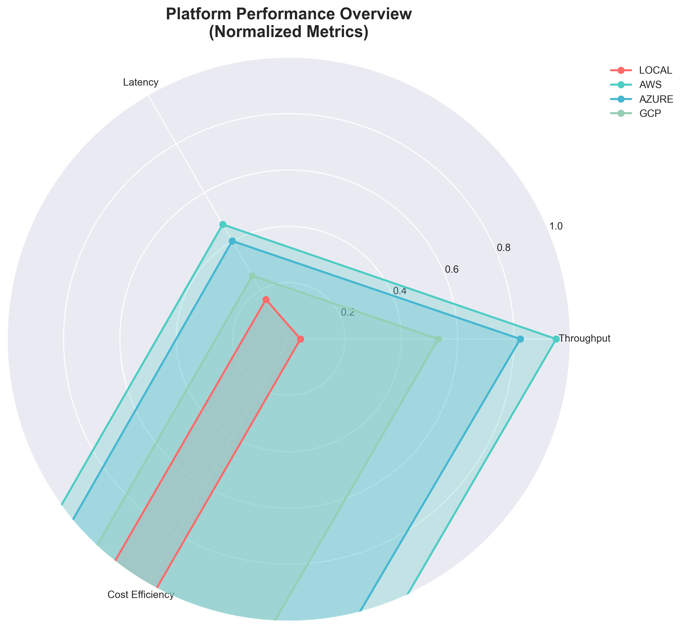

# 🚀 LLM Inference Performance Comparison Report

*Generated on 2025-09-06 23:50:16*

## 📈 Executive Summary

| Platform | Best Throughput (TPS) | Best Latency (ms) | Best TTFT (ms) | Total Tokens Generated | Test Duration (min) |
|----------|----------------------|-------------------|----------------|-----------------------|---------------------|
| LOCAL | 41.5 | 6160.0 | 410.4 | 24754 | 5.0 |
| AWS | 950.0 | 2128.9 | 2123.0 | 557013 | 5.0 |
| AZURE | 822.4 | 2488.2 | 668.2 | 490463 | 5.0 |
| GCP | 530.7 | 3856.8 | 1278.6 | 318287 | 5.1 |

## 📈 Performance Visualizations

### Performance Comparison Charts

### Platform Overview (Normalized Metrics)

*Charts show comparative performance across all platforms. Higher values are better for all metrics.*

## 📊 Detailed Performance Metrics

| Platform | Mode | Requests | Success Rate | Avg TPS | P95 TPS | Agg TPS | Avg Latency (ms) | P95 Latency (ms) | TTFT (ms) | RPS |
|----------|------|----------|--------------|---------|---------|---------|------------------|------------------|-----------|-----|
| LOCAL | Streaming | 192 | 100.0% | 10.17 | 10.41 | 40.54 | 6273.5 | 6785.1 | 410.4 | 0.64 |
| LOCAL | Non Streaming | 196 | 100.0% | 10.39 | 10.41 | 41.55 | 6160.0 | 6166.8 | - | 0.65 |
| AWS | Streaming | 4526 | 100.0% | 29.01 | 35.31 | 899.94 | 2128.9 | 2851.1 | 2123.0 | 15.01 |
| AWS | Non Streaming | 4462 | 100.0% | 30.96 | 38.53 | 949.98 | 2150.8 | 2974.3 | - | 14.84 |
| AZURE | Streaming | 3851 | 100.0% | 25.39 | 30.37 | 804.71 | 2499.9 | 2724.3 | 668.2 | 12.78 |
| AZURE | Non Streaming | 3874 | 100.0% | 25.94 | 31.35 | 822.39 | 2488.2 | 2685.2 | - | 12.85 |
| GCP | Streaming | 2508 | 100.0% | 16.27 | 17.16 | 518.50 | 3873.9 | 4097.2 | 1278.6 | 8.24 |
| GCP | Non Streaming | 2507 | 100.0% | 16.64 | 18.20 | 530.65 | 3856.8 | 4097.8 | - | 8.29 |

## 💰 Cost Analysis

| Platform | Instance Type | Hourly Cost (USD) | Estimated Monthly Cost* |
|----------|---------------|-------------------|-------------------------|
| AWS | ml.g5.2xlarge (SageMaker) | $1.5150 | $1090.80 |
| Azure | Standard_NV36adms_A10_v5 + D4s v6 | $3.4000 | $2448.00 |
| GCP | g2-standard-8 + e2-medium | $0.8800 | $633.60 |
| Local | M4 Mac (estimated power) | $0.0045 | $3.24 |

*Estimated for 24/7 operation. Actual costs may vary based on usage patterns.

### Cost Efficiency Ranking
Based on tokens per dollar per hour (higher is better):

| Rank | Platform | Throughput (TPS) | Cost/Hour | Tokens per $ per Hour |
|------|----------|------------------|-----------|----------------------|
| 1 | **AWS** | 950.0 | $1.5150 | 2,257,386 |
| 2 | **GCP** | 530.7 | $0.8800 | 2,170,860 |

**Calculation**: Tokens per hour (TPS × 3600) ÷ Cost per hour
**Example**: AWS = 950.0 TPS × 3600 ÷ $1.5150/hr = 2,257,386 tokens/$

### Cost per 1M Tokens
Industry-standard pricing comparison:

| Platform | Cost per 1M Tokens | Comparison to OpenAI GPT-4* |
|----------|-------------------|------------------------------|
| **AWS** | $0.4430 | 0.0x cheaper |
| **GCP** | $0.4606 | 0.0x cheaper |

*Based on OpenAI GPT-4 input pricing of ~$30/1M tokens as reference
**Formula**: (Hourly Cost ÷ Tokens per Hour) × 1,000,000

## 🎯 Recommendations

### By Use Case

**Development & Testing:**
- **Local** setup provides the best cost-effectiveness
- Good for prototyping and initial development
- Limited by local hardware capabilities

**Production Deployment:**
- **AWS** for maximum throughput requirements
- **AWS** for lowest latency requirements
- **GCP** for best cost-performance balance

### Streaming vs Non-Streaming
- **Streaming** is recommended for:
  - Interactive applications requiring immediate response
  - Better user experience with progressive output
  - Lower perceived latency
- **Non-Streaming** is recommended for:
  - Batch processing scenarios
  - When complete response is needed before processing
  - Slightly higher overall throughput in some cases

## 📋 Methodology

### Test Setup
- **Model**: Llama 3.1 8B (quantized versions where applicable)
- **Test Duration**: ~5 minutes per configuration
- **Concurrency**: 32 concurrent requests
- **Payload**: Standardized chat completion requests
- **Metrics Collection**: Custom llm_metrics_v2.py script

### Platforms Tested
- **Local**: llama.cpp on M4 Mac
- **AWS**: SageMaker endpoint with g5.2xlarge instance
- **Azure**: Container Instances with Standard_NC6s_v3
- **GCP**: GKE cluster with T4 GPU nodes

### Key Metrics
- **TPS (Tokens Per Second)**: Individual request throughput
- **Aggregate TPS**: Total system throughput
- **TTFT (Time To First Token)**: Latency until first response
- **Total Latency**: Complete request processing time
- **Success Rate**: Percentage of successful requests

## 🔧 Platform-Specific Details

### LOCAL

#### Streaming Mode
- **Total Requests**: 192
- **Success Rate**: 100.0%
- **Average Throughput**: 10.17 tokens/sec
- **Aggregate Throughput**: 40.54 tokens/sec
- **Average Latency**: 6273.5 ms
- **TTFT**: 410.4 ms
- **Requests/sec**: 0.64

#### Non Streaming Mode
- **Total Requests**: 196
- **Success Rate**: 100.0%
- **Average Throughput**: 10.39 tokens/sec
- **Aggregate Throughput**: 41.55 tokens/sec
- **Average Latency**: 6160.0 ms
- **TTFT**: - ms
- **Requests/sec**: 0.65

---

### AWS

#### Streaming Mode
- **Total Requests**: 4526
- **Success Rate**: 100.0%
- **Average Throughput**: 29.01 tokens/sec
- **Aggregate Throughput**: 899.94 tokens/sec
- **Average Latency**: 2128.9 ms
- **TTFT**: 2123.0 ms
- **Requests/sec**: 15.01

#### Non Streaming Mode
- **Total Requests**: 4462
- **Success Rate**: 100.0%
- **Average Throughput**: 30.96 tokens/sec
- **Aggregate Throughput**: 949.98 tokens/sec
- **Average Latency**: 2150.8 ms
- **TTFT**: - ms
- **Requests/sec**: 14.84

---

### AZURE

#### Streaming Mode
- **Total Requests**: 3851
- **Success Rate**: 100.0%
- **Average Throughput**: 25.39 tokens/sec
- **Aggregate Throughput**: 804.71 tokens/sec
- **Average Latency**: 2499.9 ms
- **TTFT**: 668.2 ms
- **Requests/sec**: 12.78

#### Non Streaming Mode
- **Total Requests**: 3874
- **Success Rate**: 100.0%
- **Average Throughput**: 25.94 tokens/sec
- **Aggregate Throughput**: 822.39 tokens/sec
- **Average Latency**: 2488.2 ms
- **TTFT**: - ms
- **Requests/sec**: 12.85

---

### GCP

#### Streaming Mode
- **Total Requests**: 2508
- **Success Rate**: 100.0%
- **Average Throughput**: 16.27 tokens/sec
- **Aggregate Throughput**: 518.50 tokens/sec
- **Average Latency**: 3873.9 ms
- **TTFT**: 1278.6 ms
- **Requests/sec**: 8.24

#### Non Streaming Mode
- **Total Requests**: 2507
- **Success Rate**: 100.0%
- **Average Throughput**: 16.64 tokens/sec
- **Aggregate Throughput**: 530.65 tokens/sec
- **Average Latency**: 3856.8 ms
- **TTFT**: - ms
- **Requests/sec**: 8.29

---

---

*This report was generated using automated benchmarking tools.*
*For detailed raw data, see individual platform result files.*